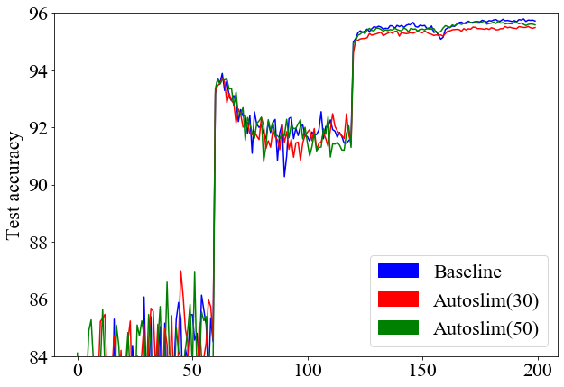
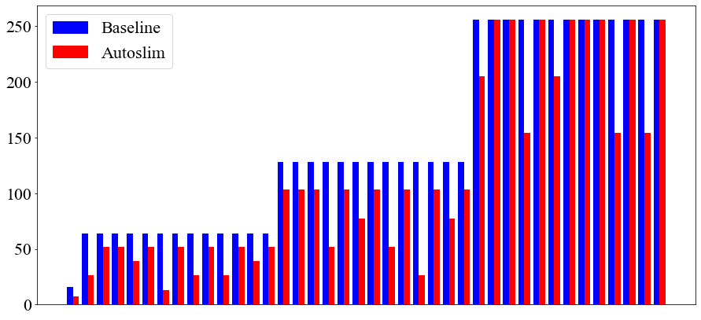
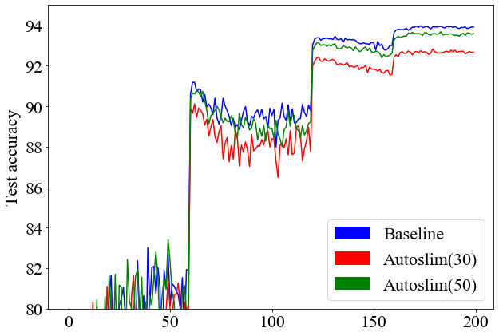

# AutoSlim: Towards One-Shot Architecture Search for Channel Numbers with TF2
- Implementation of Autoslim using Tensorflow2.
- Slimmable layers are implemented by masking, so they can be run in static mode, which is much faster than eager execution.

## Updates
- I change the mode from eager to static execution, which makes the training time more than twice faster.
- WResNet and ResNet are implemented. The experimental results will be announced.

## Note that
- This repositories hyper-parameter setting is different from the authors' one due to the limitation of the hardware.

## Paper's abstract
We study how to set channel numbers in a neural network to achieve better accuracy under constrained resources (e.g., FLOPs, latency, memory footprint or model size). A simple and one-shot solution, named AutoSlim, is presented. Instead of training many network samples and searching with reinforcement learning, we train a single slimmable network to approximate the network accuracy of different channel configurations. We then iteratively evaluate the trained slimmable model and greedily slim the layer with minimal accuracy drop. By this single pass, we can obtain the optimized channel configurations under different resource constraints. We present experiments with MobileNet v1, MobileNet v2, ResNet-50 and RL-searched MNasNet on ImageNet classification. We show significant improvements over their default channel configurations. We also achieve better accuracy than recent channel pruning methods and neural architecture search methods. Notably, by setting optimized channel numbers, our AutoSlim-MobileNet-v2 at 305M FLOPs achieves 74.2% top-1 accuracy, 2.4% better than default MobileNet-v2 (301M FLOPs), and even 0.2% better than RL-searched MNasNet (317M FLOPs). Our AutoSlim-ResNet-50 at 570M FLOPs, without depthwise convolutions, achieves 1.3% better accuracy than MobileNet-v1 (569M FLOPs).

## Requirements
- Tensorflow > 2.0
- Scipy
- about 10 GB GPU memory

## Run
```
python train_w_slimming.py --arch "archtecture name" --slimmable True --arguments
```

## Experimental results
- I only use CIFAR10 dataset due to my low hardware performance.
- Network configuration is different from the authors'. Therefore, baseline FLOPS and Params are different.
- All the training configuration is probably not optimal.
- All the numerical values and plots are the average of three results.
- The target FLOPS rate is set to 0.5.
### MobileNet-v2
```
python train_w_slimming.py --arch Mobilev2 --slimmable True
```
|             |  Accuracy |  FLOPS (M)  |  Params (M) | Model |
|:-----------:|:---------:|:-----------:|:-----------:|-------|
|   Baseline  |   92.84   |    82.56    |     2.27    |[download](http://drive.google.com/uc?export=view&id=1JY7ST4S-VOaHLs5w-J6i-Hr3DEn3Or3C)  |
|   Autoslim  |   92.83   |    40.83    |     0.93    |[download](http://drive.google.com/uc?export=view&id=17-KcV3ADUIhf1wtRDKGzUsmWh5m517qV)  |
<p align="center">
  
  <br>
  <b>An example of slimmed network via Autoslim.</b>  
</p>

### WResNet40-4
```
python train_w_slimming.py --arch WResnet-40-4 --slimmable True --weight_decay 5e-4
```
|             |  Accuracy |  FLOPS (M)  |  Params (M) |Model |
|:-----------:|:---------:|:-----------:|:-----------:|-------|
|   Baseline  |   95.72   |    82.56    |     2.27    |[download](http://drive.google.com/uc?export=view&id=1UdG2JvSm3gnbSTz7MaLT3EdtOLEHiB9_)  |
|   Autoslim  |   95.58   |    40.79    |     1.05    |[download](http://drive.google.com/uc?export=view&id=1IOYK6OGL38s6xfpSqAoXIVLyg2sA9HfE)  |

<p align="center">
  
  <br>
  <b>An example of slimmed network via Autoslim.</b>  
</p>

### ResNet56
```
python train_w_slimming.py --arch Resnet-56 --slimmable True --weight_decay 5e-4
```
|             |  Accuracy |  FLOPS (M)  |  Params (M) |Model |
|:-----------:|:---------:|:-----------:|:-----------:|-------|
|   Baseline  |   93.91   |   127.93    |    0.8600   |[download](http://drive.google.com/uc?export=view&id=1dSYUBu1gsToWgBS9M1r4l7o9dwWYOS4D)  |
|   Autoslim  |   93.59   |    62.64    |    0.4964   |[download](http://drive.google.com/uc?export=view&id=1TqQILaIJ7NpV1Q-Pv3kn3gNIHF9Bk2nY)  |

<p align="center">
  
  <br>
  <b>An example of slimmed network via Autoslim.</b>  
</p>

## Reference
```
@article{yu2019autoslim,
  title={AutoSlim: Towards One-Shot Architecture Search for Channel Numbers},
  author={Yu, Jiahui and Huang, Thomas},
  journal={arXiv preprint arXiv:1903.11728},
  volume={8},
  year={2019}
}
```

## Original project page
https://github.com/JiahuiYu/slimmable_networks
